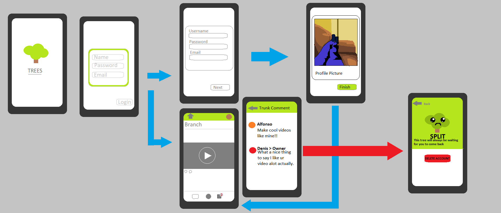
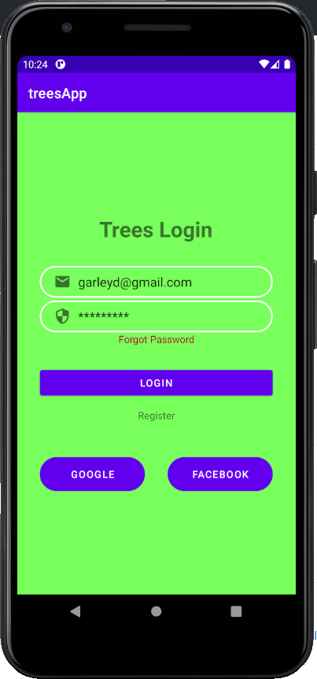

# silver-spork

What the program can do
  - The user can login
  - The user can create an account.

# WHAT YOU NEED TO RUN THIS APP
This app is not currently on in the app market. Besides that what you need is either a phone or an emulator.
When you run the app you will be prompted to enter your login information, if you do not have one you can register for one.

# PROGRAMMING SOFTWARE USED
Pygame

# Decription
This game was made with some help from youtube, I added Different features in the game to make game look better.

Try to Stay alive as you navigate the rough terrains. Through space this is an infinite game. So,
try your best to survive. And try to beat your own score.
# SOURCES
<ul>
  <li>www.youtube.com</li>
  <li>www.stackoverflow.com</li>
</ul>

# STRUCTURE

I wanted to go with this idea after a while I figured it might be a bit hard to accomplish this idea within the time frame.
So instead I settled on making a simple app.

# IMAGE OF ANDROID APP WORKING

